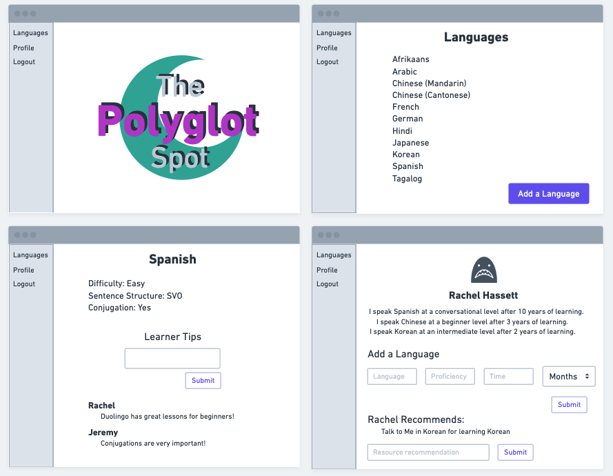
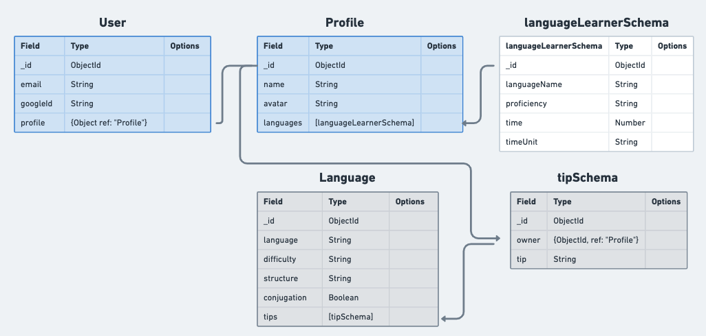

## The Polyglot Spot

<a href="https://the-polyglot-spot.fly.dev/">The Polyglot Spot</a> is a place for EFL (English as a first language) language learners to keep track of their foreign language learning and to explore other languages they might want to learn in the future. 

## Technologies Used

- EJS
- HTML
- JavaScript
- CSS
- MongoDB
- Google Auth
- Mongoose

## Planning Material

Wireframes:

ERD:

## Future Plans

In the future I would like users to be able to languages from the Language page to an 'Interests' list on their profile. I would also like users to be able to edit the languages currently listen on their profile.